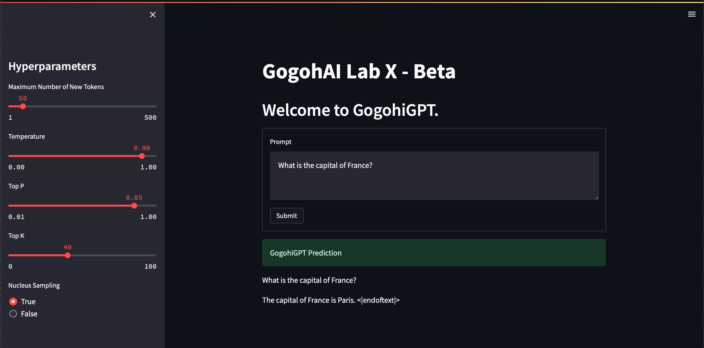

# LLM Deployment in Streamlit

This is a short example on how to deploy a generative model in streamlit and easily share it with others!
Since I wanted the application to be run locally I have chosen the relatively small GPT-Neo-125M and instruction tuned it. Due to its size, I will not share the model here, but in general thius example will work with any generative model, which can be loaded in huggingface transformers.

To run the application please run `uvicorn main:app --reload` in one terminal. This will spin up the fast-api server containing the model and serving predictions. The streamlit application can be run with `streamlit run frontend.py`. Have fun!

  
  <figcaption>Fig.1 - Model Deployment within Streamlit Application</figcaption>

